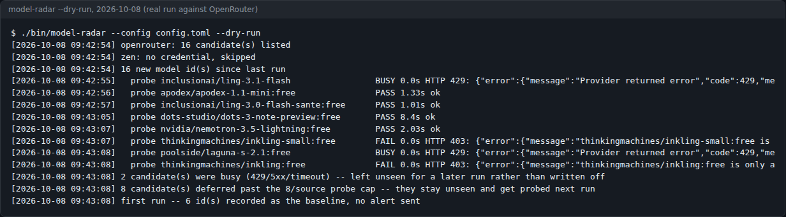
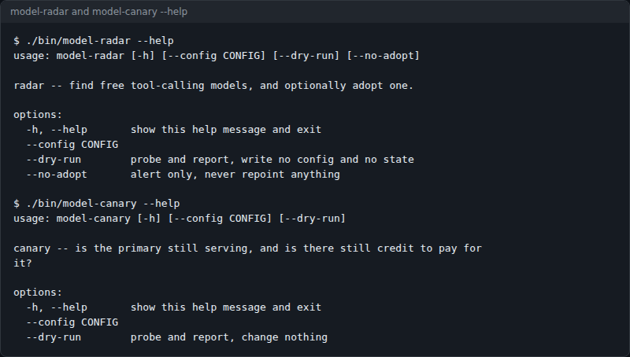
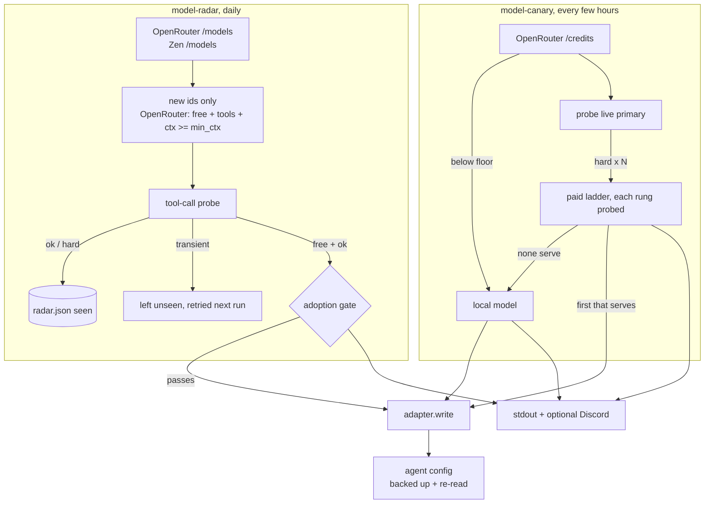

# model-radar

Two deterministic checks for people running LLM agents on hosted model APIs: `model-radar` finds free models that really make tool calls, and `model-canary` fails your agents over when the paid primary disappears or the credit runs out.



*A real `--dry-run` against OpenRouter on 2026-10-08. Four models passed the tool-call probe, two returned 403, two were rate-limited and left for a later run, and eight waited behind the per-run probe cap.*

 

Neither tool asks a model for an opinion. They gather facts (prices, balances, probe results) and act on them.

## What it does

- **Lists free models** on OpenRouter (zero prompt and completion price, `tools` advertised, context at or above `min_ctx`) and on OpenCode Zen, which publishes no prices.
- **Probes each new model with a real tool call.** The model must call `get_weather` with `city` set to Reykjavik. A reply in prose, a wrong call or unparseable arguments counts as a fail.
- **Sorts every result three ways**: `ok`, `hard` (model gone, key rejected, no credit) or `transient` (408/409/429/5xx, timeouts). Transient results are never treated as a verdict.
- **Optionally adopts a free model as primary**, only through a gate: OpenRouter only, a context floor, three spaced clean probes, a latency limit measured against the incumbent in the same run, and a 7-day cooldown. Off by default.
- **Watches the live primary and the balance** (`model-canary`): reads the OpenRouter credit balance, probes the primary, and after N consecutive hard failures walks a paid fallback ladder, then a local model.
- **Changes agent config only through an adapter.** `jsonfile` (a JSON file your launcher reads) and `hermes` (hermes-agent profiles) ship. Every write backs up the old file and re-reads the new one.
- **Alerts** to stdout, and to Discord if a webhook is set.

## Screenshots



*Both commands' `--help`, captured from this repo on 2026-10-08.*

## Quick start

Prerequisites: Python 3.11 or newer (`tomllib`), an OpenRouter API key. No third-party packages unless you use the `hermes` adapter (then `PyYAML`).

```bash
git clone https://github.com/casareanderson/model-radar.git
cd model-radar
cp config.example.toml config.toml
export OPENROUTER_API_KEY=sk-or-...
./bin/model-radar --dry-run
```

Success looks like the screenshot above: a count of candidates, one `probe` line per model with `PASS`, `FAIL` or `BUSY`, and a closing line. `--dry-run` writes no config and no state. Free models cost nothing to probe.

Then try the canary. It needs a target to watch, so create the file the `jsonfile` adapter reads:

```bash
mkdir -p ~/.config/model-radar
cat > ~/.config/model-radar/models.json <<'EOF'
{"agents": {"coder": {"provider": "openrouter", "model": "qwen/qwen3.7-flash", "context_length": 1000000}}}
EOF
./bin/model-canary --dry-run
```

The canary prints your remaining credit and `primary <model> ok (<n>s)`, or what it would fail over to. Probing a paid primary costs one short completion.

## Usage

```bash
./bin/model-radar                 # discover, record, alert on new free tool-callers
./bin/model-radar --no-adopt      # alert only, never repoint anything
./bin/model-canary                # check credit + primary, fail over if needed
./bin/model-radar --config /etc/model-radar.toml   # or set MODELRADAR_CONFIG
```

Run them on a timer: the canary every few hours, the radar daily. For example:

```cron
30 4 * * *  cd /opt/model-radar && ./bin/model-radar  >> /var/log/model-radar.log 2>&1
0 */3 * * * cd /opt/model-radar && ./bin/model-canary >> /var/log/model-canary.log 2>&1
```

What a failover looked like in the deployment this was extracted from, when the provider region-gated the primary:

```
[18:00:03] go: hard failure #1 -- HTTP 403: RegionError ...
[21:00:02] go: hard failure #2 -- HTTP 403: RegionError ...
[21:00:03] Primary failed over -- deepseek-v4-flash -> deepseek-v4-flash-0731
```

`model-canary` exits 1 when there is no API key, when credit is below the floor with no local fallback, or when nothing on the ladder serves. Watch the exit code as well as the alerts: a broken webhook only logs to stdout.

## Configuration

Settings load from built-in defaults, then a TOML file (`--config`, `$MODELRADAR_CONFIG`, or `./config.toml`). Secrets are never read from the TOML file.

**Environment**

| Name | Default | What it does |
|---|---|---|
| `OPENROUTER_API_KEY` | none | Required. Listing, probing, credit balance. |
| `ZEN_API_KEY` | none | Optional OpenCode Zen source. Falls back to `OPENAI_API_KEY`. Without either, Zen is skipped. |
| `MODELRADAR_DISCORD_WEBHOOK` | none | Optional Discord alerts. The variable name itself is set by `notify.discord_webhook_env`. |
| `MODELRADAR_CONFIG` | `config.toml` | Path to the TOML file. |

**TOML keys** (see [config.example.toml](config.example.toml))

| Key | Default | What it does |
|---|---|---|
| `state_dir` | `~/.local/state/model-radar` | Where `radar.json` (seen models, adoptions) and `canary.json` (failure count) live. |
| `adapter.name` | `jsonfile` | `jsonfile` or `hermes`. |
| `adapter.path` | `~/.config/model-radar/models.json` | `jsonfile` only: the file to read and write. |
| `adapter.env_file` | unset | Read keys from this file if they are not in the environment. Read only. |
| `adapter.home`, `local_base_url`, `local_model` | `~/.hermes`, empty, empty | `hermes` only. |
| `radar.min_ctx` | `200000` | Smallest context a candidate may have. |
| `radar.headline_ctx` | `500000` | Context at which an alert marks a model as headline class. |
| `radar.max_probes_per_source` | `8` | Probes per source per run. The rest stay unseen and are tried next run. |
| `radar.adopt` | `false` | Allow adoption at all. |
| `radar.adopt_targets` | `[]` | Targets that may be repointed. The first one is the latency baseline. |
| `radar.adopt_min_ctx` | `500000` | Context floor for adoption. |
| `radar.adopt_confirms` / `adopt_confirm_gap_s` | `3` / `8` | Consecutive clean probes needed, and seconds between them. |
| `radar.adopt_latency_factor` / `adopt_latency_abs_max_s` | `2.5` / `5.0` | Latency limit: the lower of factor x incumbent and the absolute cap. |
| `radar.adopt_cooldown_days` | `7` | Minimum days between adoptions. |
| `canary.targets` | `[]` | Targets to manage. Empty means every target the adapter sees. |
| `canary.fails_before_failover` | `2` | Consecutive hard failures before failing over. |
| `canary.credit_floor_usd` / `credit_warn_usd` | `1.50` / `4.00` | Below the floor, revert to local. Below warn, alert. |
| `canary.paid_ladder` | `[]` | Ordered `{model, context_length}` rungs, each probed before use. |
| `canary.local.base_url`, `canary.local.model` | empty | The local fallback, e.g. an Ollama endpoint. |
| `user_agent` | `curl/8.5.0` | Sent on every request. Cloudflare rejects Python's default (error 1010). |
| `openrouter.*`, `zen.*` | provider URLs | Endpoint overrides. |

## How it works



Three rules hold the design together. They are in the code, and each came from an incident in the estate this was built for.

1. **A 200 is not a capability test.** On OpenRouter every free model advertises tool support, and some then return `403 only available on agentic harnesses`. Others answer in prose. So the probe asks for one specific tool call and checks the name and argument. Price comes from metadata; capability is measured.
2. **Unreachable is not dead.** During discovery a busy model is left unrecorded so it is retried, not buried. In the canary a transient result does not count towards failover. The one inversion is adoption confirmation, where a transient counts as a fail: a model about to run everything must not be contended.
3. **Free is not a saving if it is slow.** The incumbent is probed in the same run to set the latency baseline. If the incumbent will not probe cleanly, nothing is adopted. If the first target is not on OpenRouter (for example after a failover), nothing is adopted over the revert.

Other details worth knowing:

- Newest model ids are probed first, because a stealth preview is a recent id.
- A model that has been probed is recorded, so one that was adopted and later failed away is not silently re-adopted.
- An unreadable balance is treated as unknown, never as zero.
- The canary only repoints targets on the provider it measured. A target on a different provider is left alone.
- The `hermes` adapter refuses YAML with duplicate keys and gives a local fallback entry its own `base_url`, because hermes has one `providers.custom` slot per config scope.

Writing your own adapter means three methods on `modelradar.adapters.base.Adapter`: `targets()`, `read()`, `write()`. `write` must back up what it overwrites and re-read the result.

```
model-radar/
├── bin/
│   ├── model-radar          # entry point → modelradar.radar
│   └── model-canary         # entry point → modelradar.canary
├── modelradar/
│   ├── radar.py             # discovery, state, adoption gate
│   ├── canary.py            # credit check, primary probe, ladder failover
│   ├── probe.py             # the tool-call probe and ok/hard/transient classifier
│   ├── config.py            # defaults, TOML merge, secret lookup
│   ├── notify.py            # stdout + Discord webhook
│   └── adapters/
│       ├── base.py          # Adapter contract and Primary dataclass
│       ├── jsonfile.py      # reference adapter (plain JSON file)
│       └── hermes.py        # hermes-agent profiles (needs PyYAML)
└── config.example.toml
```

## Status, limits and real results

- **Measured 2026-10-08** (the screenshot above): OpenRouter listed 16 free tool-advertising models at 200k+ context. Of the 8 probed, 4 passed (1.01s to 8.4s), 2 returned 403, and 2 returned 429 and were left for a later run.
- An earlier run in the original deployment found a free model (`nemotron-3-ultra-free`) that answered every request but never made a tool call (`FAIL 25.51s no tool_call`).
- **`--dry-run` never saves state**, so every dry run counts as a first run: it prints the baseline line and sends no alert, even when it finds something. Run once without `--dry-run` (with `adopt = false`, the default) to establish a baseline.
- It does not judge whether a model is good. It measures tool-calling, latency and context.
- Credit checking and adoption are OpenRouter-only. Zen models are alerted on but never adopted.
- If no ladder rung serves and no local model is configured, the canary can only alert.
- A failed alert never stops the check, which also means a broken webhook fails quietly.
- No automated tests in this repo.

## The write-up

What running agents across your own hardware, OpenRouter and a coding subscription costs, measured on a live estate: **[Token Routing](https://asareanderson.gumroad.com/l/esuwce)** (£18) and a [2-page cheat sheet](https://asareanderson.gumroad.com/l/ufdbr) (£4). More field notes at **[dev.to/c1-anderson](https://dev.to/c1-anderson)**.

## Licence and credits

MIT — see [LICENSE](LICENSE).

Uses the [OpenRouter](https://openrouter.ai) and [OpenCode Zen](https://opencode.ai) APIs. The `hermes` adapter targets [hermes-agent](https://hermes-agent.nousresearch.com) and uses [PyYAML](https://pyyaml.org) (MIT). Model names in examples are whatever the providers listed at the time; availability changes without notice, which is the point of the tool.
